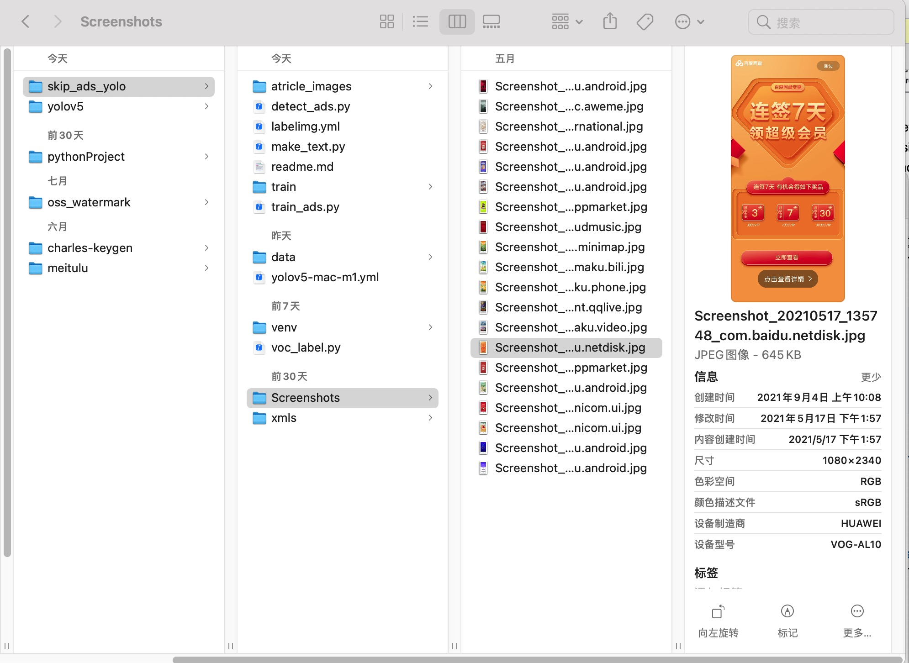
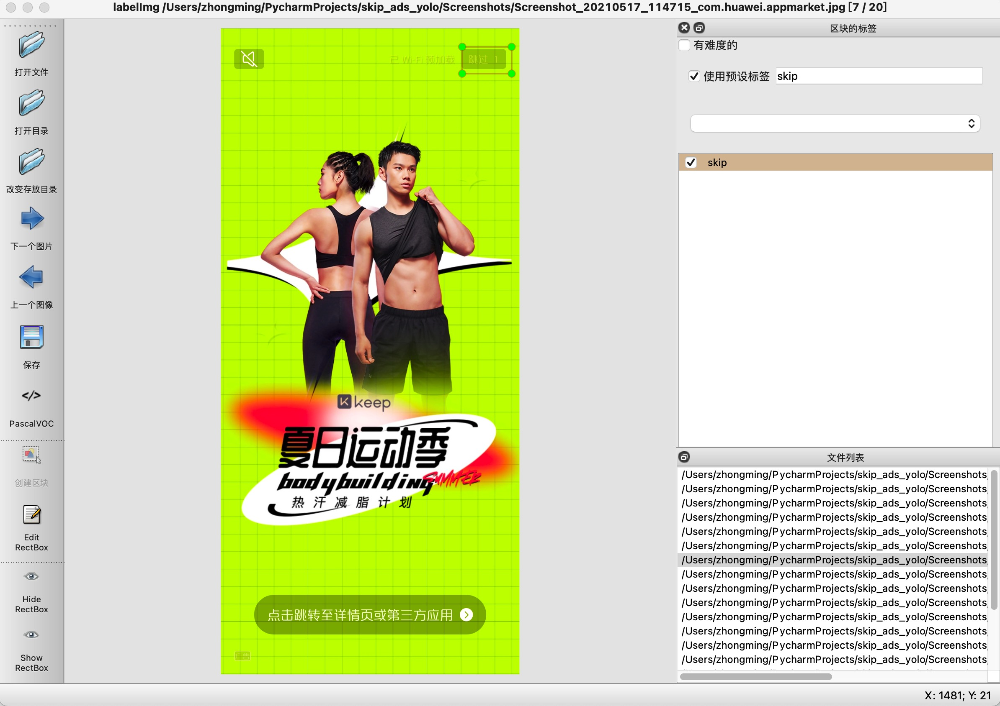
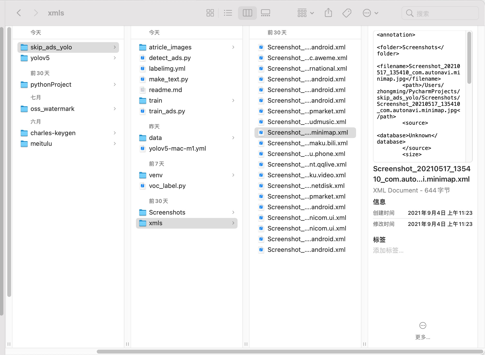
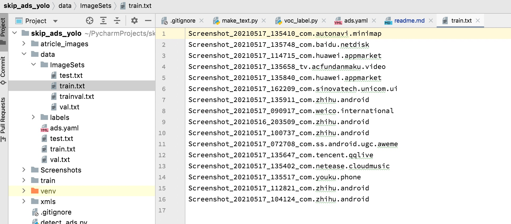
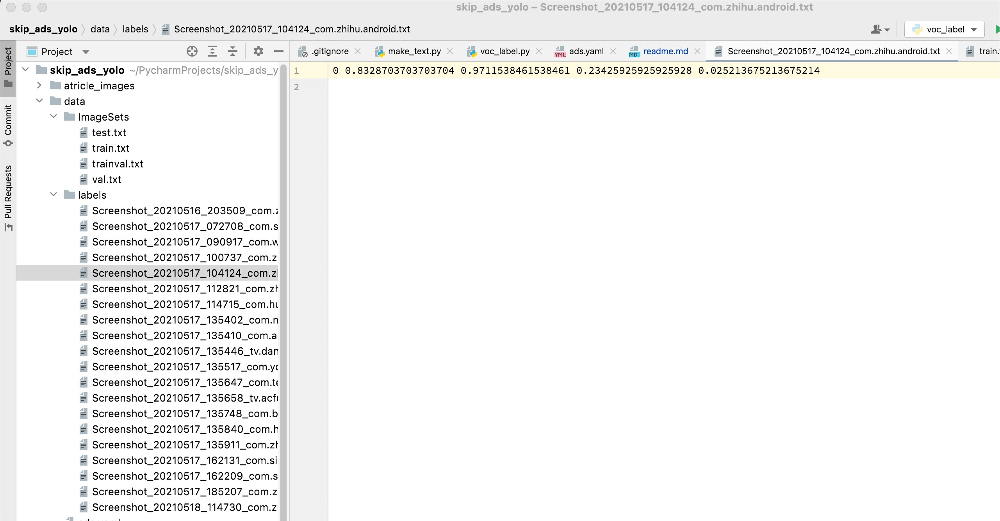
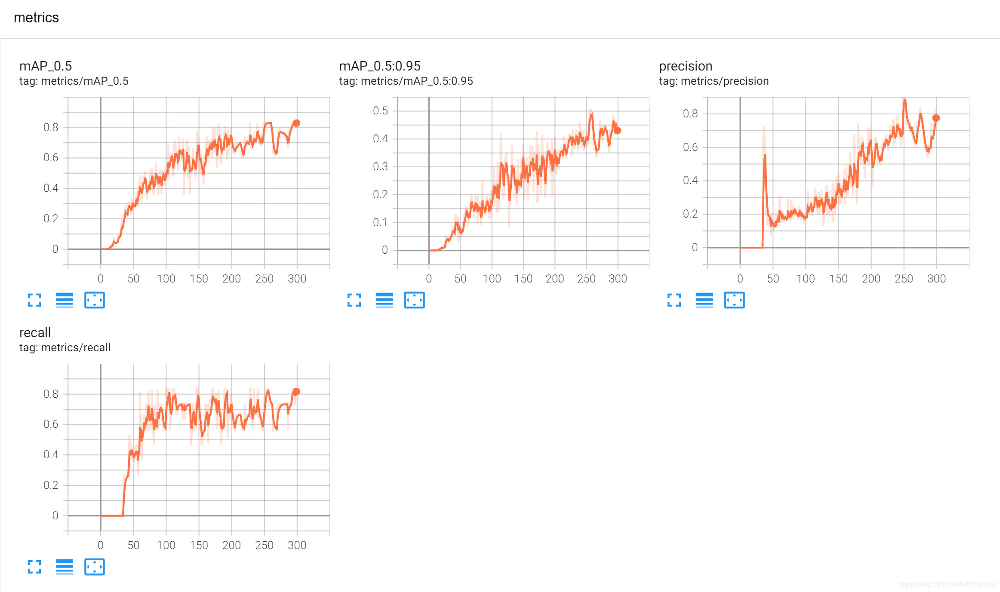

----
Android Skip Ads Yolov5 Project
----
---

  

[YOLOv5](https://github.com/ultralytics/yolov5) 🚀 is a family of object detection architectures and models pretrained on the COCO dataset, and represents Ultralytics open-source research into future vision AI methods, incorporating lessons learned and best practices evolved over thousands of hours of research and development.

**1. 环境搭建**  
自动广告跳过这个想法,不过由于各种原因一直没有实时。知道最近才又重新开始折腾这个东西,yolov5的安装这里就不再说明了，建议使用anaconda安装。我创建了一个conda环境可以直接下载之后通过conda安装：  
```shell
# 1. conda 环境地址：https://anaconda.org/obaby/yolov5
# 2. 下载对应操作系统的环境yml脚本
# 3. 在Terminal 或者 an Anaconda Prompt内执行
conda env create user/my-environment
source activate my-environment
```  

如果不想使用上面的安装方法可以参考：https://blog.csdn.net/oJiWuXuan/article/details/107558286 和https://github.com/ultralytics/yolov5 按照官方指导进行安装。  

**2.数据准备**  
将手机上已经准备好的截图复制到Screenshot目录下，使用[labelImg](https://github.com/tzutalin/labelImg){conda 环境地址：https://anaconda.org/obaby/labelimg 可以直接导入使用},对图片进行标记。将标记后的xml文件保存到xmls目录下。    
屏幕截图：  
  
labelimg标记：  
  
xml文件路径：  
  
**3.构建数据集：**  
在根目录下创建make_text.py代码如下(**以下代码基本都是拷贝自：https://blog.csdn.net/oJiWuXuan/article/details/107558286 这篇文章，表示感谢！！**)：  
```python
import os
import random

# https://blog.csdn.net/oJiWuXuan/article/details/107558286

trainval_percent = 0.9
train_percent = 0.9
xmlfilepath = 'xmls'
txtsavepath = 'Screenshots'
total_xml = os.listdir(xmlfilepath)

num = len(total_xml)
list = range(num)
tv = int(num * trainval_percent)
tr = int(tv * train_percent)
trainval = random.sample(list, tv)
train = random.sample(trainval, tr)

ftrainval = open('data/ImageSets/trainval.txt', 'w')
ftest = open('data/ImageSets/test.txt', 'w')
ftrain = open('data/ImageSets/train.txt', 'w')
fval = open('data/ImageSets/val.txt', 'w')

for i in list:
    name = total_xml[i][:-4] + '\n'
    if i in trainval:
        ftrainval.write(name)
        if i in train:
            ftrain.write(name)
        else:
            fval.write(name)
    else:
        ftest.write(name)

ftrainval.close()
ftrain.close()
fval.close()
ftest.close()

```  
创建voc_label.py代码如下，需要注意classes中的列别信息：  
```python
# xml解析包
import xml.etree.ElementTree as ET
import pickle
import os
# os.listdir() 方法用于返回指定的文件夹包含的文件或文件夹的名字的列表
from os import listdir, getcwd
from os.path import join


sets = ['train', 'test', 'val']
classes = ['skip']


# 进行归一化操作
def convert(size, box): # size:(原图w,原图h) , box:(xmin,xmax,ymin,ymax)
    dw = 1./size[0]     # 1/w
    dh = 1./size[1]     # 1/h
    x = (box[0] + box[1])/2.0   # 物体在图中的中心点x坐标
    y = (box[2] + box[3])/2.0   # 物体在图中的中心点y坐标
    w = box[1] - box[0]         # 物体实际像素宽度
    h = box[3] - box[2]         # 物体实际像素高度
    x = x*dw    # 物体中心点x的坐标比(相当于 x/原图w)
    w = w*dw    # 物体宽度的宽度比(相当于 w/原图w)
    y = y*dh    # 物体中心点y的坐标比(相当于 y/原图h)
    h = h*dh    # 物体宽度的宽度比(相当于 h/原图h)
    return (x, y, w, h)    # 返回 相对于原图的物体中心点的x坐标比,y坐标比,宽度比,高度比,取值范围[0-1]


# year ='2012', 对应图片的id（文件名）
def convert_annotation(image_id):
    '''
    将对应文件名的xml文件转化为label文件，xml文件包含了对应的bunding框以及图片长款大小等信息，
    通过对其解析，然后进行归一化最终读到label文件中去，也就是说
    一张图片文件对应一个xml文件，然后通过解析和归一化，能够将对应的信息保存到唯一一个label文件中去
    labal文件中的格式：calss x y w h　　同时，一张图片对应的类别有多个，所以对应的ｂｕｎｄｉｎｇ的信息也有多个
    '''
    # 对应的通过year 找到相应的文件夹，并且打开相应image_id的xml文件，其对应bund文件
    in_file = open('train/%s.xml' % (image_id), encoding='utf-8')
    # 准备在对应的image_id 中写入对应的label，分别为
    # <object-class> <x> <y> <width> <height>
    out_file = open('data/labels/%s.txt' % (image_id), 'w', encoding='utf-8')
    # 解析xml文件
    tree = ET.parse(in_file)
    # 获得对应的键值对
    root = tree.getroot()
    # 获得图片的尺寸大小
    size = root.find('size')
    # 如果xml内的标记为空，增加判断条件
    if size != None:
        # 获得宽
        w = int(size.find('width').text)
        # 获得高
        h = int(size.find('height').text)
        # 遍历目标obj
        for obj in root.iter('object'):
            # 获得difficult ？？
            difficult = obj.find('difficult').text
            # 获得类别 =string 类型
            cls = obj.find('name').text
            # 如果类别不是对应在我们预定好的class文件中，或difficult==1则跳过
            if cls not in classes or int(difficult) == 1:
                continue
            # 通过类别名称找到id
            cls_id = classes.index(cls)
            # 找到bndbox 对象
            xmlbox = obj.find('bndbox')
            # 获取对应的bndbox的数组 = ['xmin','xmax','ymin','ymax']
            b = (float(xmlbox.find('xmin').text), float(xmlbox.find('xmax').text), float(xmlbox.find('ymin').text),
                 float(xmlbox.find('ymax').text))
            print(image_id, cls, b)
            # 带入进行归一化操作
            # w = 宽, h = 高， b= bndbox的数组 = ['xmin','xmax','ymin','ymax']
            bb = convert((w, h), b)
            # bb 对应的是归一化后的(x,y,w,h)
            # 生成 calss x y w h 在label文件中
            out_file.write(str(cls_id) + " " + " ".join([str(a) for a in bb]) + '\n')


# 返回当前工作目录
wd = getcwd()
print(wd)


for image_set in sets:
    '''
    对所有的文件数据集进行遍历
    做了两个工作：
　　　　１．将所有图片文件都遍历一遍，并且将其所有的全路径都写在对应的txt文件中去，方便定位
　　　　２．同时对所有的图片文件进行解析和转化，将其对应的bundingbox 以及类别的信息全部解析写到label 文件中去
    　　　　　最后再通过直接读取文件，就能找到对应的label 信息
    '''
    # 先找labels文件夹如果不存在则创建
    if not os.path.exists('data/labels/'):
        os.makedirs('data/labels/')
    # 读取在ImageSets/Main 中的train、test..等文件的内容
    # 包含对应的文件名称
    image_ids = open('data/ImageSets/%s.txt' % (image_set)).read().strip().split()
    # 打开对应的2012_train.txt 文件对其进行写入准备
    list_file = open('data/%s.txt' % (image_set), 'w')
    # 将对应的文件_id以及全路径写进去并换行
    for image_id in image_ids:
        list_file.write('data/images/%s.jpg\n' % (image_id))
        # 调用  year = 年份  image_id = 对应的文件名_id
        convert_annotation(image_id)
    # 关闭文件
    list_file.close()

# os.system(‘comand’) 会执行括号中的命令，如果命令成功执行，这条语句返回0，否则返回1
# os.system("cat 2007_train.txt 2007_val.txt 2012_train.txt 2012_val.txt > train.txt")
# os.system("cat 2007_train.txt 2007_val.txt 2007_test.txt 2012_train.txt 2012_val.txt > train.all.txt")

```
分别运行makeTxt.py和voc_label.py。

make_text.py主要是将数据集分类成训练数据集和测试数据集，默认train，val，test按照8：1：1的比例进行随机分类，运行后ImagesSets文件夹中会出现四个文件，主要是生成的训练数据集和测试数据集的图片名称，如下图。同时data目录下也会出现这四个文件，内容是训练数据集和测试数据集的图片路径。
  
voc_label.py主要是将图片数据集标注后的xml文件中的标注信息读取出来并写入txt文件，运行后在labels文件夹中出现所有图片数据集的标注信息，如下图：  
  
到这里，数据资源准备就ok了。
**4.修改配置文件**  
在data目录下创建ads.yml内容如下：  
```yaml
# COCO 2017 dataset http://cocodataset.org
# Download command: bash yolov5/data/get_coco2017.sh
# Train command: python train.py --data ./data/coco.yaml
# Dataset should be placed next to yolov5 folder:
#   /parent_folder
#     /coco
#     /yolov5


# train and val datasets (image directory or *.txt file with image paths)
train: data/train.txt  # 118k images
val: data/val.txt  # 5k images
test: data/test.txt  # 20k images for submission to https://competitions.codalab.org/competitions/20794

# number of classes
nc: 1

# class names
names: ['skip']

# Print classes
# with open('data/coco.yaml') as f:
#   d = yaml.load(f, Loader=yaml.FullLoader)  # dict
#   for i, x in enumerate(d['names']):
#     print(i, x)

```  
修改网络参数models/yolov5s.yaml(这里取决于你使用了哪个模型就去修改对于的文件，该项目中使用的是yolov5s模型),主要修改nc参数：
```yaml
# YOLOv5 🚀 by Ultralytics, GPL-3.0 license

# Parameters
nc: 1  # number of classes
depth_multiple: 0.33  # model depth multiple
width_multiple: 0.50  # layer channel multiple
anchors:
  - [10,13, 16,30, 33,23]  # P3/8
  - [30,61, 62,45, 59,119]  # P4/16
  - [116,90, 156,198, 373,326]  # P5/32

# YOLOv5 backbone
backbone:
  # [from, number, module, args]
  [[-1, 1, Focus, [64, 3]],  # 0-P1/2
   [-1, 1, Conv, [128, 3, 2]],  # 1-P2/4
   [-1, 3, C3, [128]],
   [-1, 1, Conv, [256, 3, 2]],  # 3-P3/8
   [-1, 9, C3, [256]],
   [-1, 1, Conv, [512, 3, 2]],  # 5-P4/16
   [-1, 9, C3, [512]],
   [-1, 1, Conv, [1024, 3, 2]],  # 7-P5/32
   [-1, 1, SPP, [1024, [5, 9, 13]]],
   [-1, 3, C3, [1024, False]],  # 9
  ]

# YOLOv5 head
head:
  [[-1, 1, Conv, [512, 1, 1]],
   [-1, 1, nn.Upsample, [None, 2, 'nearest']],
   [[-1, 6], 1, Concat, [1]],  # cat backbone P4
   [-1, 3, C3, [512, False]],  # 13

   [-1, 1, Conv, [256, 1, 1]],
   [-1, 1, nn.Upsample, [None, 2, 'nearest']],
   [[-1, 4], 1, Concat, [1]],  # cat backbone P3
   [-1, 3, C3, [256, False]],  # 17 (P3/8-small)

   [-1, 1, Conv, [256, 3, 2]],
   [[-1, 14], 1, Concat, [1]],  # cat head P4
   [-1, 3, C3, [512, False]],  # 20 (P4/16-medium)

   [-1, 1, Conv, [512, 3, 2]],
   [[-1, 10], 1, Concat, [1]],  # cat head P5
   [-1, 3, C3, [1024, False]],  # 23 (P5/32-large)

   [[17, 20, 23], 1, Detect, [nc, anchors]],  # Detect(P3, P4, P5)
  ]
```  
train_ads.py 参数修改，主要参数解释如下。我们平时训练的话，主要用到的只有这几个参数而已：–weights，–cfg，–data，–epochs，–batch-size，–img-size，–project：  
```yaml
def parse_opt(known=False):
    parser = argparse.ArgumentParser()
    parser.add_argument('--weights', type=str, default='yolov5s.pt', help='initial weights path')
    parser.add_argument('--cfg', type=str, default='', help='model.yaml path')
    parser.add_argument('--data', type=str, default='data/ads.yaml', help='dataset.yaml path')
    parser.add_argument('--hyp', type=str, default='data/hyps/hyp.scratch.yaml', help='hyperparameters path')
    parser.add_argument('--epochs', type=int, default=300)
    parser.add_argument('--batch-size', type=int, default=16, help='total batch size for all GPUs')
    parser.add_argument('--imgsz', '--img', '--img-size', type=int, default=640, help='train, val image size (pixels)')
    parser.add_argument('--rect', action='store_true', help='rectangular training')
    parser.add_argument('--resume', nargs='?', const=True, default=False, help='resume most recent training')
    parser.add_argument('--nosave', action='store_true', help='only save final checkpoint')
    parser.add_argument('--noval', action='store_true', help='only validate final epoch')
    parser.add_argument('--noautoanchor', action='store_true', help='disable autoanchor check')
    parser.add_argument('--evolve', type=int, nargs='?', const=300, help='evolve hyperparameters for x generations')
    parser.add_argument('--bucket', type=str, default='', help='gsutil bucket')
    parser.add_argument('--cache', type=str, nargs='?', const='ram', help='--cache images in "ram" (default) or "disk"')
    parser.add_argument('--image-weights', action='store_true', help='use weighted image selection for training')
    parser.add_argument('--device', default='', help='cuda device, i.e. 0 or 0,1,2,3 or cpu')
    parser.add_argument('--multi-scale', action='store_true', help='vary img-size +/- 50%%')
    parser.add_argument('--single-cls', default=True,action='store_true', help='train multi-class data as single-class')
    parser.add_argument('--adam', action='store_true', help='use torch.optim.Adam() optimizer')
    parser.add_argument('--sync-bn', action='store_true', help='use SyncBatchNorm, only available in DDP mode')
    parser.add_argument('--workers', type=int, default=8, help='maximum number of dataloader workers')
    parser.add_argument('--project', default='runs/train', help='save to project/name')
    parser.add_argument('--entity', default=None, help='W&B entity')
    parser.add_argument('--name', default='exp', help='save to project/name')
    parser.add_argument('--exist-ok', action='store_true', help='existing project/name ok, do not increment')
    parser.add_argument('--quad', action='store_true', help='quad dataloader')
    parser.add_argument('--linear-lr', action='store_true', help='linear LR')
    parser.add_argument('--label-smoothing', type=float, default=0.0, help='Label smoothing epsilon')
    parser.add_argument('--upload_dataset', action='store_true', help='Upload dataset as W&B artifact table')
    parser.add_argument('--bbox_interval', type=int, default=-1, help='Set bounding-box image logging interval for W&B')
    parser.add_argument('--save_period', type=int, default=-1, help='Log model after every "save_period" epoch')
    parser.add_argument('--artifact_alias', type=str, default="latest", help='version of dataset artifact to be used')
    parser.add_argument('--local_rank', type=int, default=-1, help='DDP parameter, do not modify')
    parser.add_argument('--freeze', type=int, default=0, help='Number of layers to freeze. backbone=10, all=24')
    parser.add_argument('--patience', type=int, default=30, help='EarlyStopping patience (epochs)')
    opt = parser.parse_known_args()[0] if known else parser.parse_args()
    return opt
```
**5.训练模型**  
环境搭建好，数据准备完毕之后就可以开始进行魔性的训练了。直接执行train_ads.py进行模型训练：  
```shell
(yolov5) zhongming@ZhongMingdeMacBook-Pro yolov5 % python train_ads.py                                                   
train: weights=yolov5s.pt, cfg=, data=data/ads.yaml, hyp=data/hyps/hyp.scratch.yaml, epochs=300, batch_size=16, imgsz=640, rect=False, resume=False, nosave=False, noval=False, noautoanchor=False, evolve=None, bucket=, cache=None, image_weights=False, device=, multi_scale=False, single_cls=True, adam=False, sync_bn=False, workers=8, project=runs/train, entity=None, name=exp, exist_ok=False, quad=False, linear_lr=False, label_smoothing=0.0, upload_dataset=False, bbox_interval=-1, save_period=-1, artifact_alias=latest, local_rank=-1, freeze=0, patience=30
github: ⚠️ YOLOv5 is out of date by 25 commits. Use `git pull` or `git clone https://github.com/ultralytics/yolov5` to update.
YOLOv5 🚀 v5.0-405-gfad57c2 torch 1.9.0 CPU

hyperparameters: lr0=0.01, lrf=0.2, momentum=0.937, weight_decay=0.0005, warmup_epochs=3.0, warmup_momentum=0.8, warmup_bias_lr=0.1, box=0.05, cls=0.5, cls_pw=1.0, obj=1.0, obj_pw=1.0, iou_t=0.2, anchor_t=4.0, fl_gamma=0.0, hsv_h=0.015, hsv_s=0.7, hsv_v=0.4, degrees=0.0, translate=0.1, scale=0.5, shear=0.0, perspective=0.0, flipud=0.0, fliplr=0.5, mosaic=1.0, mixup=0.0, copy_paste=0.0
TensorBoard: Start with 'tensorboard --logdir runs/train', view at http://localhost:6006/
wandb: (1) Create a W&B account
wandb: (2) Use an existing W&B account
wandb: (3) Don't visualize my results
wandb: Enter your choice: 3
wandb: You chose 'Don't visualize my results'
wandb: WARNING `resume` will be ignored since W&B syncing is set to `offline`. Starting a new run with run id 18h6dxo0.
wandb: W&B syncing is set to `offline` in this directory.  Run `wandb online` or set WANDB_MODE=online to enable cloud syncing.
Overriding model.yaml nc=80 with nc=1

                 from  n    params  module                                  arguments                     
  0                -1  1      3520  models.common.Focus                     [3, 32, 3]                    
  1                -1  1     18560  models.common.Conv                      [32, 64, 3, 2]                
  2                -1  1     18816  models.common.C3                        [64, 64, 1]                   
  3                -1  1     73984  models.common.Conv                      [64, 128, 3, 2]               
  4                -1  3    156928  models.common.C3                        [128, 128, 3]                 
  5                -1  1    295424  models.common.Conv                      [128, 256, 3, 2]              
  6                -1  3    625152  models.common.C3                        [256, 256, 3]                 
  7                -1  1   1180672  models.common.Conv                      [256, 512, 3, 2]              
  8                -1  1    656896  models.common.SPP                       [512, 512, [5, 9, 13]]        
  9                -1  1   1182720  models.common.C3                        [512, 512, 1, False]          
 10                -1  1    131584  models.common.Conv                      [512, 256, 1, 1]              
 11                -1  1         0  torch.nn.modules.upsampling.Upsample    [None, 2, 'nearest']          
 12           [-1, 6]  1         0  models.common.Concat                    [1]                           
 13                -1  1    361984  models.common.C3                        [512, 256, 1, False]          
 14                -1  1     33024  models.common.Conv                      [256, 128, 1, 1]              
 15                -1  1         0  torch.nn.modules.upsampling.Upsample    [None, 2, 'nearest']          
 16           [-1, 4]  1         0  models.common.Concat                    [1]                           
 17                -1  1     90880  models.common.C3                        [256, 128, 1, False]          
 18                -1  1    147712  models.common.Conv                      [128, 128, 3, 2]              
 19          [-1, 14]  1         0  models.common.Concat                    [1]                           
 20                -1  1    296448  models.common.C3                        [256, 256, 1, False]          
 21                -1  1    590336  models.common.Conv                      [256, 256, 3, 2]              
 22          [-1, 10]  1         0  models.common.Concat                    [1]                           
 23                -1  1   1182720  models.common.C3                        [512, 512, 1, False]          
 24      [17, 20, 23]  1     16182  models.yolo.Detect                      [1, [[10, 13, 16, 30, 33, 23], [30, 61, 62, 45, 59, 119], [116, 90, 156, 198, 373, 326]], [128, 256, 512]]
[W NNPACK.cpp:79] Could not initialize NNPACK! Reason: Unsupported hardware.
Model Summary: 283 layers, 7063542 parameters, 7063542 gradients, 16.4 GFLOPs

Transferred 356/362 items from yolov5s.pt
Scaled weight_decay = 0.0005
optimizer: SGD with parameter groups 59 weight, 62 weight (no decay), 62 bias
train: Scanning 'data/train' images and labels...16 found, 0 missing, 0 empty, 0 corrupted: 100%|██| 16/16 [00:02<00:00,  6.10it/s]
train: New cache created: data/train.cache
val: Scanning 'data/val' images and labels...2 found, 0 missing, 0 empty, 0 corrupted: 100%|█████████| 2/2 [00:04<00:00,  2.46s/it]
val: New cache created: data/val.cache
Plotting labels... 

autoanchor: Analyzing anchors... anchors/target = 4.44, Best Possible Recall (BPR) = 1.0000
Image sizes 640 train, 640 val
Using 8 dataloader workers
Logging results to runs/train/exp3
Starting training for 300 epochs...

     Epoch   gpu_mem       box       obj       cls    labels  img_size
     0/299        0G    0.1386   0.01956         0        28       640: 100%|████████████████████████| 1/1 [00:33<00:00, 33.46s/it]
               Class     Images     Labels          P          R     mAP@.5 mAP@.5:.95: 100%|████████| 1/1 [00:00<00:00,  1.56it/s]                 all          2          0          0          0          0          0
               Class     Images     Labels          P          R     mAP@.5 mAP@.5:.95: 100%|████████| 1/1 [00:00<00:00,  1.56it/s]

     Epoch   gpu_mem       box       obj       cls    labels  img_size
     1/299        0G    0.1378    0.0202         0        31       640: 100%|████████████████████████| 1/1 [00:27<00:00, 27.41s/it]
               Class     Images     Labels          P          R     mAP@.5 mAP@.5:.95: 100%|████████| 1/1 [00:00<00:00,  1.66it/s]
                 all          2          0          0          0          0          0
     Epoch   gpu_mem       box       obj       cls    labels  img_size
   150/299        0G   0.05562   0.01635         0        27       640: 100%|████████████████████████| 1/1 [00:26<00:00, 26.94s/it]
               Class     Images     Labels          P          R     mAP@.5 mAP@.5:.95: 100%|████████| 1/1 [00:00<00:00,  1.85it/s]
                 all          2          2       0.99        0.5      0.535      0.252

     Epoch   gpu_mem       box       obj       cls    labels  img_size
   151/299        0G   0.05614   0.01598         0        23       640: 100%|████████████████████████| 1/1 [00:26<00:00, 26.93s/it]
               Class     Images     Labels          P          R     mAP@.5 mAP@.5:.95: 100%|████████| 1/1 [00:00<00:00,  1.86it/s]
                 all          2          2      0.997        0.5      0.538      0.207
EarlyStopping patience 30 exceeded, stopping training.

152 epochs completed in 8.084 hours.
Optimizer stripped from runs/train/exp3/weights/last.pt, 14.4MB
Optimizer stripped from runs/train/exp3/weights/best.pt, 14.4MB

wandb: Waiting for W&B process to finish, PID 63332
wandb: Program ended successfully.
wandb: Find user logs for this run at: /Users/zhongming/PycharmProjects/yolov5/wandb/offline-run-20210913_191626-18h6dxo0/logs/debug.log
wandb: Find internal logs for this run at: /Users/zhongming/PycharmProjects/yolov5/wandb/offline-run-20210913_191626-18h6dxo0/logs/debug-internal.log
wandb: Run summary:
wandb:                 train/box_loss 0.05614
wandb:                 train/obj_loss 0.01598
wandb:                 train/cls_loss 0.0
wandb:              metrics/precision 0.99749
wandb:                 metrics/recall 0.5
wandb:                metrics/mAP_0.5 0.53848
wandb:           metrics/mAP_0.5:0.95 0.20678
wandb:                   val/box_loss 0.06087
wandb:                   val/obj_loss 0.02391
wandb:                   val/cls_loss 0.0
wandb:                          x/lr0 0.0009
wandb:                          x/lr1 0.0009
wandb:                          x/lr2 0.0858
wandb:                       _runtime 29117
wandb:                     _timestamp 1631560903
wandb:                          _step 152
wandb: Run history:
wandb:         train/box_loss ███▇▇▇▇▆▆▆▅▅▅▄▄▅▄▄▃▃▅▄▄▃▂▃▂▂▃▂▂▂▂▂▂▂▂▁▂▂
wandb:         train/obj_loss ▅▅▅▄▃▃▃▂▄▄▅▄▃▆▄▄▅▁▅▅▃▅▆█▇██▃▁▃▃▃▆▄▅▂▆▅▄▂
wandb:         train/cls_loss ▁▁▁▁▁▁▁▁▁▁▁▁▁▁▁▁▁▁▁▁▁▁▁▁▁▁▁▁▁▁▁▁▁▁▁▁▁▁▁▁
wandb:      metrics/precision ▁▁▁▁▁▁▁▁▁▁▁▁▁▂▁▁▁▁▂▁▁▁▁▁▁▁▁▂▃▃▄█████████
wandb:         metrics/recall ▁▁▁▁▁▁▁▁▁▁▁▅▅▅▁▅▅█▅▁▅▅█▅▅▅▅▅▅▅▅▅▅▅▅▅▅▅▅▅
wandb:        metrics/mAP_0.5 ▁▁▁▁▁▁▁▁▁▁▁▁▁▂▁▁▁▁▂▁▁▁▁▁▁▂▂▂▃▃▄█████████
wandb:   metrics/mAP_0.5:0.95 ▁▁▁▁▁▁▁▁▁▁▁▁▁▁▁▁▁▁▁▁▁▁▁▁▁▁▂▂▃▃▅█▅▆▆▅▅▆▅▅
wandb:           val/box_loss █████▇▇▇▇▆▆▅▅▅▅▅▅▄▄▅▅▄▄▃▂▃▂▂▃▂▂▂▁▁▁▂▂▂▂▁
wandb:           val/obj_loss ▄▄▄▃▃▂▂▁▁▁▂▂▂▂▂▂▂▃▃▃▂▃▄▅▇▆▇▇▇▆▇▆█▇▇▆▆▆▄▆
wandb:           val/cls_loss ▁▁▁▁▁▁▁▁▁▁▁▁▁▁▁▁▁▁▁▁▁▁▁▁▁▁▁▁▁▁▁▁▁▁▁▁▁▁▁▁
wandb:                  x/lr0 ▁▁▁▂▂▂▃▃▃▄▄▄▄▅▅▅▅▆▆▆▆▆▇▇▇▇▇▇▇███████████
wandb:                  x/lr1 ▁▁▁▂▂▂▃▃▃▄▄▄▄▅▅▅▅▆▆▆▆▆▇▇▇▇▇▇▇███████████
wandb:                  x/lr2 ████▇▇▇▇▇▆▆▆▆▆▆▅▅▅▅▅▅▄▄▄▄▄▃▃▃▃▃▃▂▂▂▂▂▁▁▁
wandb:               _runtime ▁▁▁▁▁▁▁▁▁▂▂▂▂▃▃▃▃▃▃▃▃▄▅▅▆▆▇▇▇▇▇▇▇▇▇█████
wandb:             _timestamp ▁▁▁▁▁▁▁▁▁▂▂▂▂▃▃▃▃▃▃▃▃▄▅▅▆▆▇▇▇▇▇▇▇▇▇█████
wandb:                  _step ▁▁▁▁▂▂▂▂▂▃▃▃▃▃▃▄▄▄▄▄▅▅▅▅▅▅▆▆▆▆▆▇▇▇▇▇▇███
wandb: 
wandb: You can sync this run to the cloud by running:
wandb: wandb sync /Users/zhongming/PycharmProjects/yolov5/wandb/offline-run-20210913_191626-18h6dxo0

```
训练结束之后的文件保存在Optimizer stripped from runs/train/exp3/weights/last.pt, 14.4MB  Optimizer stripped from runs/train/exp3/weights/best.pt, 14.4MB两个文件中。到这里模型训练就结束了。  
在训练中，也可以随时查看每一轮次训练的结果，可利用tensorboard可视化训练过程，训练开始时会在runs/train/exp文件夹中产生一个“events.out.tfevents.1608924773.JWX.5276.0”文件，利用tensorboard打开即可查看训练日志。首先我们通过cmd进去该YOLOv5所在的项目文件夹，然后激活所用的虚拟环境，输入如下命令行：
```shell
tensorboard --logdir runs/train/exp
```

命令行输入信息的整体显示如下所示：
```shell
activate yolov5

ensorboard --logdir runs/train/exp
TensorFlow installation not found - running with reduced feature set.
Serving TensorBoard on localhost; to expose to the network, use a proxy or pass --bind_all
TensorBoard 2.4.0 at http://localhost:6006/ (Press CTRL+C to quit)

```
到这一步后，我们就可打开 http://localhost:6006/ 网页查看每一轮次训练的结果，如图所示。
  
**6.实现检查**  
修改detect_ads.py中的参数主要用到的只有这几个参数：–weights，–source，–conf-thres，–project：  
```python
def parse_opt():
    parser = argparse.ArgumentParser()
    parser.add_argument('--weights', nargs='+', type=str, default='runs/train/exp3/weights/last.pt', help='model.pt path(s)')
    parser.add_argument('--source', type=str, default='data/images', help='file/dir/URL/glob, 0 for webcam')
    parser.add_argument('--imgsz', '--img', '--img-size', nargs='+', type=int, default=[640], help='inference size h,w')
    parser.add_argument('--conf-thres', type=float, default=0.1, help='confidence threshold')
    parser.add_argument('--iou-thres', type=float, default=0.45, help='NMS IoU threshold')
    parser.add_argument('--max-det', type=int, default=1000, help='maximum detections per image')
    parser.add_argument('--device', default='', help='cuda device, i.e. 0 or 0,1,2,3 or cpu')
    parser.add_argument('--view-img', action='store_true', help='show results')
    parser.add_argument('--save-txt', action='store_true', help='save results to *.txt')
    parser.add_argument('--save-conf', action='store_true', help='save confidences in --save-txt labels')
    parser.add_argument('--save-crop', action='store_true', help='save cropped prediction boxes')
    parser.add_argument('--nosave', action='store_true', help='do not save images/videos')
    parser.add_argument('--classes', nargs='+', type=int, help='filter by class: --class 0, or --class 0 2 3')
    parser.add_argument('--agnostic-nms', action='store_true', help='class-agnostic NMS')
    parser.add_argument('--augment', action='store_true', help='augmented inference')
    parser.add_argument('--visualize', action='store_true', help='visualize features')
    parser.add_argument('--update', action='store_true', help='update all models')
    parser.add_argument('--project', default='runs/detect', help='save results to project/name')
    parser.add_argument('--name', default='exp', help='save results to project/name')
    parser.add_argument('--exist-ok', action='store_true', help='existing project/name ok, do not increment')
    parser.add_argument('--line-thickness', default=3, type=int, help='bounding box thickness (pixels)')
    parser.add_argument('--hide-labels', default=False, action='store_true', help='hide labels')
    parser.add_argument('--hide-conf', default=False, action='store_true', help='hide confidences')
    parser.add_argument('--half', action='store_true', help='use FP16 half-precision inference')
    opt = parser.parse_args()
    opt.imgsz *= 2 if len(opt.imgsz) == 1 else 1  # expand
    return opt


```
通过下面的命令进行检测：  
```shell
python detect_ads.py --source /Users/zhongming/PycharmProjects/skip_ads_yolo/Screenshots/Screenshot_20210517_135446_tv.danmaku.bili.jpg
```  
检测回显：  
```shell
python detect_ads.py --source /Users/zhongming/PycharmProjects/skip_ads_yolo/Screenshots/Screenshot_20210517_135446_tv.danmaku.bili.jpg
detect: weights=runs/train/exp3/weights/best.pt, source=/Users/zhongming/PycharmProjects/skip_ads_yolo/Screenshots/Screenshot_20210517_135446_tv.danmaku.bili.jpg, imgsz=[640, 640], conf_thres=0.01, iou_thres=0.45, max_det=1000, device=, view_img=False, save_txt=False, save_conf=False, save_crop=False, nosave=False, classes=None, agnostic_nms=False, augment=False, visualize=False, update=False, project=runs/detect, name=exp, exist_ok=False, line_thickness=3, hide_labels=False, hide_conf=False, half=False
YOLOv5 🚀 v5.0-405-gfad57c2 torch 1.9.0 CPU

Fusing layers... 
[W NNPACK.cpp:79] Could not initialize NNPACK! Reason: Unsupported hardware.
Model Summary: 224 layers, 7053910 parameters, 0 gradients, 16.3 GFLOPs
image 1/1 /Users/zhongming/PycharmProjects/skip_ads_yolo/Screenshots/Screenshot_20210517_135446_tv.danmaku.bili.jpg: 640x320 31 skips, Done. (0.297s)
Results saved to runs/detect/exp22
Done. (0.388s)
```
如果不修改detect.py文件这可以通过下面的命令进行检测：  
```shell
yolov5 % python detect_ads.py --source /Users/zhongming/PycharmProjects/skip_ads_yolo/Screenshots/Screenshot_20210517_135446_tv.danmaku.bili.jpg --weights  ads_best.pt 
```
检测效果，由于样本太少，导致检测到的概率太低，为了显示出来这里把parser.add_argument('--conf-thres', type=float, default=0.1,）--conf-thres调成了0.1否则直接检测不到跳过按钮，调低之后检测到的跳过按钮有的并不是跳过按钮(后一张图)。  
  
下图检测到的按钮是有问题的：  
  
为了提高检测准确度，下一步会加大样本量再次训练，等待看效果吧 ~~  

安卓apk开屏广告跳过按钮识别项目  


---
obaby@mars  
http://www.h4ck.org.cn  
http://www.obaby.org.cn  


参考链接：  
https://github.com/EvgenMeshkin/ScreenShot/blob/master/app/src/main/java/by/android/evgen/screenshot/ScreenActivity.java  
https://blog.csdn.net/qq_38499859/article/details/90523283  
https://juejin.cn/post/6844903589127651335  
https://stackoverflow.com/questions/2661536/how-to-programmatically-take-a-screenshot-on-android  
https://pytorch.org  
https://developer.nvidia.com/cuda-downloads?target_os=Windows&target_arch=x86_64&target_version=10&target_type=exe_network
